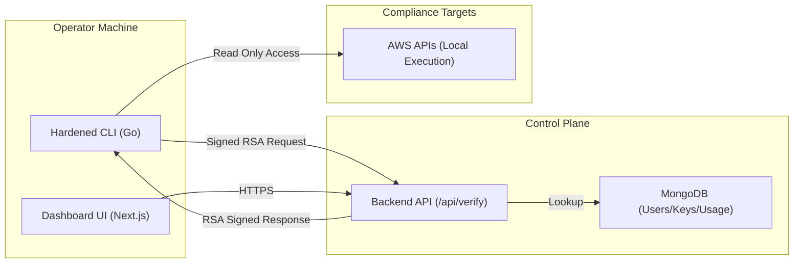

# 📔 Cloud Auditor — Master Documentation Guide

Welcome to the comprehensive guide for **Cloud Auditor**. This document consolidates all technical manuals, security policies, architecture breakdowns, and compliance mappings into a single source of truth.

---

## 🗺️ Table of Contents

1.  [**Introduction**](#-introduction)
2.  [**Quick Start Guide**](#-quick-start-guide)
3.  [**Core Components & Features**](#-core-components--features)
4.  [**System Architecture**](#-system-architecture)
5.  [**Security & Anti-Crack Hardening**](#-security--anti-crack-hardening)
6.  [**Build & Distribution**](#-build--distribution)
7.  [**Compliance Mapping Reference**](#-compliance-mapping-reference)
8.  [**AWS Security Checks Library**](#-aws-security-checks-library)

---

## 🏛️ Introduction

Cloud Auditor is the ultimate cloud security and compliance platform. It is a comprehensive security suite designed to audit AWS environments with extreme speed and military-grade privacy. It transforms complex API data into stunning, compliance-mapped reports while keeping your data 100% local.

### Core Philosophy
- **Local First**: Your AWS credentials never leave your machine.
- **Security First**: Cryptographically signed licenses and hardware binding.
- **Speed First**: Highly parallelized Go engine.

---

## 🚀 Quick Start Guide

Go from zero to your first audit in under 2 minutes.

### 1. Installation
Download the binary for your OS:
- **Mac (M1/M2/M3)**: `curl -L https://cloudauditor.io/dl/darwin-arm64 -o cloud-auditor`
- **Linux (amd64)**: `curl -L https://cloudauditor.io/dl/linux-amd64 -o cloud-auditor`

### 2. Environment Setup
Ensure your local AWS credentials are set:
```bash
export AWS_ACCESS_KEY_ID=...
export AWS_SECRET_ACCESS_KEY=...
```

### 3. Run a Scan
```bash
chmod +x cloud-auditor
./cloud-auditor scan --region us-east-1
```

### 4. Unlock Premium Features
1. Start the Dashboard: `cd web && npm run dev`
2. Create an account at `http://localhost:3002`
3. Generate an API Key in the "API Keys" tab.
4. Login in the CLI: `./cloud-auditor login`

---

## 💎 Core Components & Features

The platform consists of three high-fidelity modules:
1.  **Hardened CLI (Go)**: A high-performance engine that performs audits locally.
2.  **Cyber-Professional Dashboard (Next.js)**: A glassmorphic web interface for API key management and analytics.
3.  **Security Core**: A proprietary RSA-signed licensing system.

### Key Features
*   🛡️ **Anti-Crack Hardening**: Every CLI-to-Cloud communication is RSA-256 signed. 
*   📊 **Visual Analytics**: Interactive HTML dashboards with sleek dark-mode aesthetics.
*   📑 **Compliance Mastery**: Automated mapping to SOC 2, HIPAA, ISO 27001, and CIS.
*   🚀 **Remediation Ready**: Get exact `aws-cli` commands for every finding.

---

## 🏗️ System Architecture

Cloud Auditor follows a distributed SaaS pattern where control is centralized but execution is local.

### High-Level Ecosystem


### Module Breakdown
- **CLI Engine**: Uses Go routines for parallel scanning. Implements hardware fingerprinting via `machineid`.
- **Backend API**: Node.js/Next.js routes. Handles RSA signing of JWS payloads.
- **Report Generator**: Embedded HTML/CSS template engine inside the Go binary.

---

## 🔒 Security & Anti-Crack Hardening

Our security model is built on three pillars of defense.

### 1. RSA-256 Response Signing
Every packet from the server is a JWS signed with a Private RSA-2048 key. The CLI verifies this against an embedded Public Key. This prevents server spoofing and local proxy hacks.

### 2. Hardware Identity Binding
API Keys are bound to a specific `machine-id` (Motherboard UUID, CPU ID). If a key is shared across different hardware, the server rejects the request.

### 3. Binary Obfuscation
Production builds are stripped of all symbols (`-ldflags="-s -w"`) to frustrate reverse engineering tools. Critical features are woven into the main execution flow to prevent easy patching.

---

## 🔨 Build & Distribution

### CLI Build Commands
- **Developer Build**: `go build -o cloud-auditor main.go`
- **Hardened Production Build**: `go build -o cloud-auditor -ldflags="-s -w" ./main.go`

### Web Dashboard Setup
```bash
cd web
npm install
npm run dev
# Requires MONGODB_URI and NEXTAUTH_SECRET in .env.local
```

### Makefile Reference
- `make build-all`: Cross-compiles for Mac, Windows, and Linux.
- `make setup-security`: Prepares RSA keys for embedding.

---

## 📋 Compliance Mapping Reference

| Framework | Full Name | Tier Required |
|---|---|---|
| CIS | CIS AWS Foundations Benchmark v2.0 | Free |
| SOC 2 | SOC 2 Type II Trust Services Criteria | Enterprise |
| HIPAA | HIPAA Security Rule | Enterprise |
| ISO 27001 | ISO/IEC 27001:2022 | Enterprise |

*Detailed mappings for S3, EC2, IAM, and RDS are included in the audit reports and the source code metadata.*

---

## 🔍 AWS Security Checks Library

### S3 Checks
- **S3-001**: Public Access Block Missing (Critical)
- **S3-003**: Default Encryption Disabled (High)

### EC2 Checks
- **EC2-001**: SSH Port Open to Internet (Critical)
- **EC2-003**: IMDSv2 Not Enforced (High)

### IAM Checks
- **IAM-001**: Root MFA Disabled (Critical)
- **IAM-004**: Access Keys Not Rotated > 90 Days (High)

### RDS Checks
- **RDS-001**: Database Publicly Accessible (Critical)
- **RDS-002**: Storage Encryption Disabled (High)

---

© 2026 Cloud Auditor. All rights reserved. Proprietary software.
