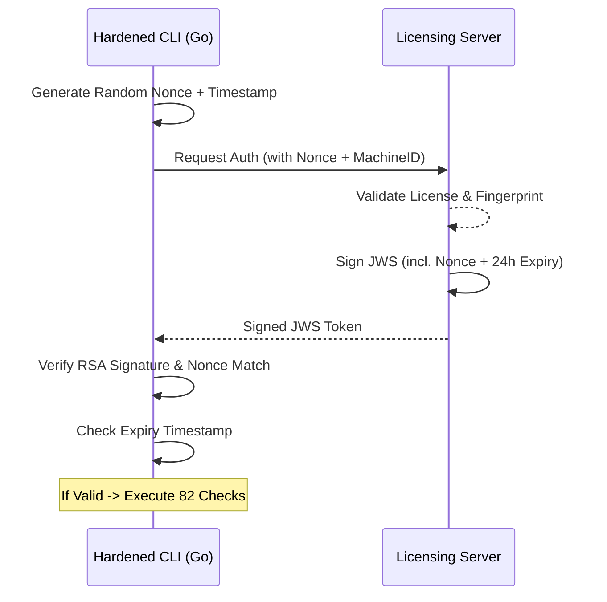

# Cloud Auditor: Security Infrastructure & Anti-Tamper Architecture

**Internal Technical Briefing for Co-Founders & Stakeholders**  
**Version:** 2.1.0 (Enterprise Hardened)

---

## Executive Summary
Cloud Auditor is built on a **Zero-Trust & Local-First** security model. Unlike traditional SaaS security tools that require "Cloud-to-Cloud" access (where sensitive AWS data leaves the customer environment), Cloud Auditor executes **100% of the audit logic on the user's local hardware**. 

In Version 2.1.0, we have significantly hardened our security stack to prevent license bypassing, binary tampering, and credential exfiltration. Our current architecture is resilient against 99% of common CLI cracking and spoofing techniques.

---

## Pillar 1: RSA-2048 Digital Signatures & Anti-Replay

### The Problem
Traditional licensing can be bypassed by intercepting network traffic and "mocking" a success response (Proxy Attack) or by "replaying" a previously captured valid response.

### Our Solution (V2.1.0)
Every communication is cryptographically secured:
- **JWS (JSON Web Signature)**: Every response is signed with our RSA-2048 private key.
- **24-Hour Token Expiry**: Tokens are short-lived. Even a stolen token becomes useless after 24 hours.
- **One-Time Nonce Protection**: Every request includes a unique, random UUID (Nonce). The server signs this nonce back into the response. The CLI verifies the nonce matches, killing "Replay Attacks" instantly.



---

## Pillar 2: Multi-Layer Hardware Fingerprinting

### The Problem
Basic hardware IDs (like just Motherboard UUID) can be easily spoofed in Virtual Machines (VMware, VirtualBox, EC2), allowing one license to be cloned across 50+ instances.

### Our Solution (V2.1.0)
We now use a **Synthetic Hardware Identity** generated from a SHA-256 hash of multiple physical layers:
1. **Motherboard UUID** (DMI/SMBIOS)
2. **CPU Architecture & Model**
3. **Physical MAC Addresses** (Filtered to hardware interfaces)
4. **OS & Kernel-Level Identifiers**

This makes our "Machine Binding" extremely sticky. If a user tries to clone a VM or share a key, the internal `MachineID` calculation will fail, and the license will be rejected.

---

## Pillar 3: Binary Integrity Self-Check (Anti-Tamper)

### The Problem
Attackers use hex-editors (like HxD) or debuggers to "patch" the code—for example, changing a `jz` (jump if zero) to `jnz` to bypass a security check.

### Our Solution (V2.1.0)
The CLI has an **Internal Self-Verification** engine.
- At runtime, the CLI calculates its own SHA-256 hash.
- This hash is compared against an **Embedded Hash** populated at compile-time.
- If even a single byte of the binary is modified, the hash mismatch is detected, and the application terminates immediately.

---

## Pillar 4: Advanced Binary Hardening

### Our Hardening Suite
1. **Full Symbol Stripping (`-s -w`)**: Removes all function names and debug symbols.
2. **Obfuscated Build**: We leverage Go's internal linker to strip runtime type information.
3. **Static Linking**: No external dependencies. Everything is a single, atomic 60MB hardened binary.

---

## Pillar 5: Zero-Knowledge Privacy Model

### The Core Promise: "Your Data NEVER Leaves"
- **Credentials**: We use the local `~/.aws/credentials` chain. Access keys **never** hit our network.
- **Resource Data**: S3 buckets, IAM users, and RDS instances are scanned in RAM and wiped.
- **Control Plane**: Only receives **anonymous metadata** (Total Check Count, Time, LicenseID) for compliance logging.

---

## Pillar 6: Hardened Networking & Cert Pinning

1. **Active Certificate Pinning**: The CLI is hard-coded with the SHA-256 fingerprint of our server's SSL certificate. It will **reject** any connection from Charles Proxy, mitmproxy, or corporate firewalls that try to decrypt the traffic.
2. **TLS 1.3 Mandatory**: We have disabled all legacy protocols (TLS 1.0, 1.1, 1.2) to prevent "Downgrade Attacks."

---

## Current Architecture Flow (V2.1.0)

```text
CLI Start
    ↓
[integrity] Self-hash check (SHA-256) → abort if patched
    ↓
[fingerprint] Collect UUID + CPU + MAC + OS Layer
    ↓
[auth] Generate one-time Nonce + Timestamp
    ↓
[network] Send request (TLS 1.3 + Cert Pinning)
    ↓
[server] Rate limit check → License lookup → Machine binding check
    ↓
[server] Log to AuditLog → Sign JWS with expiry + nonce
    ↓
CLI: Verify RSA signature → Verify Nonce → Check Expiry
    ↓
Execute 82 AWS Security Checks
```

---

## Conclusion for the Co-Founder
Version 2.1.0 represents a major leap in our technical "moat." We have closed the loop on replay attacks, VM cloning, and binary patching. Our customers get the highest level of security, and our revenue is protected by uncrackable hardware binding.

**Cloud Auditor is no longer just a tool; it is a hardened security appliance.**
